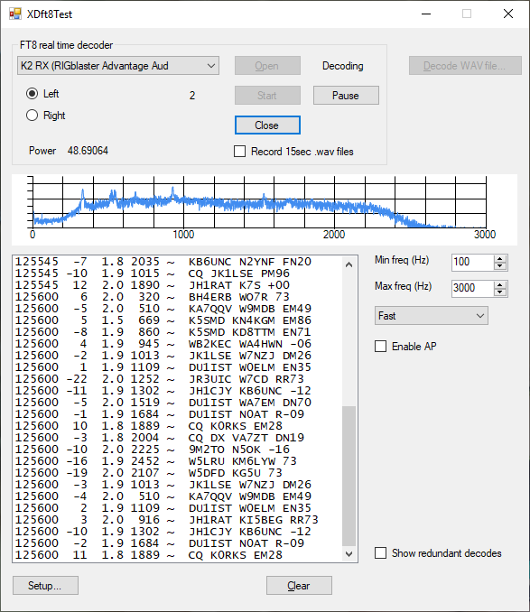

# Digi-XDft
Copyright (c) 2019 by Wayne E. Wright, W5XD 
.NET wrappers for FT8 modulate and demodulate, including a sample program

<blockquote>The algorithms, source code, look-and-feel of WSJT-X and related programs, and protocol specifications for the modes FSK441, FT8, JT4, JT6M JT9, JT65, JTMS, QRA64, ISCAT, MSK144 are Copyright (C) 2001-2018 by one or more of the following authors: Joseph Taylor, K1JT; Bill Somerville, G4WJS; Steven Franke, K9AN; Nico Palermo, IV3NWV; Grea Bream, KI7MT; Michael Black, W9MDB; Edson Pereira, PY2SDR; Philip Karn, KA9Q; and other members of the WSJT Development Group.</blockquote>

This project contains the XDft.dll .NET assembly which wraps the FT8 encoder/decoder by Joe Taylor, K1JT. This assembly,
with some help reading/writing a sound card, can produce FT8 tones on a sound card, or decode received FT8 tones into text.
The "help reading/writing a sound card" is found in a submodule.

See <a href='COPYING'>COPYING</a> for the license. This code depends on that published for wsjtx-2.1.0.

This project also contains XDft8Test.exe which is an example of how to put the various pieces together into a working program.
In addition to the submodule, you'll need the XDwsjtFT8.dll from the project <a href='https://github.com/w5xd/Digi-XDwsjt'>Digi-XDwsjt</a>.

To build this project, expect to edit the .props files to reflect the disk locations of the various needed components. Boost version 1.67 is recommended. It is old, but newer versions of boost have eliminated the sha1 hash algorithm needed here.

